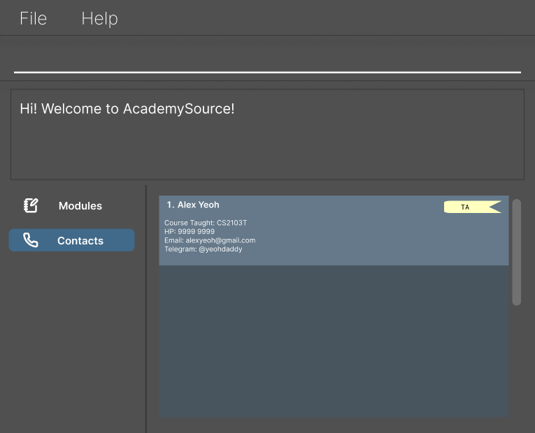

# AcademySource
> "The key to success in tech industry is not good programming skills, it's strong networking." - An advice given by a computing senior when I first entered NUS.

Ever wished to conduct research for a specific field but don't know the correct professors to look for?

Ever felt the dread of losing hundreds of telegram contacts because you lose your telegram account, with no way of getting them back without their telegram handle? 

Or what if you want to become a TA for a module, want to know more about the TA experience from the senior who have taught you as a TA, but simply forgot their name and contacts?

Fret not! With AcademySource, you can retrieve key contacts of TAs and Professors from a snap of a fingertip. This simple application stores handphone number, email address and even telegram handles of TAs so that even when you forget, even when you lose your account, there is a backup for you.

## User Guide
Detailed user guide can be found in the [User Guide](https://github.com/AY2425S2-CS2103T-T17-4/tp/blob/master/docs/UserGuide.md) section.

## Developer Guide
Interested to contribute to AcademySource? You may follow the [Developer Guide](https://github.com/AY2425S2-CS2103T-T17-4/tp/blob/master/docs/DeveloperGuide.md) for more.

## Acknowledgement
This project is based on the AddressBook-Level3 project created by the [SE-EDU initiative](https://se-education.org).