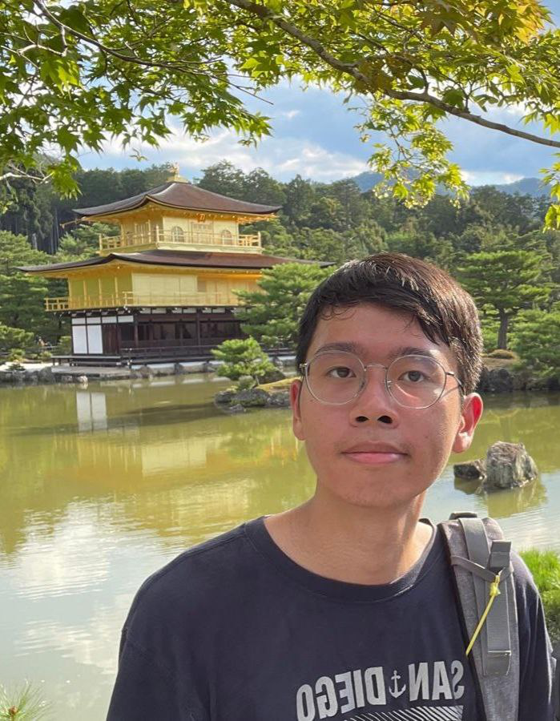
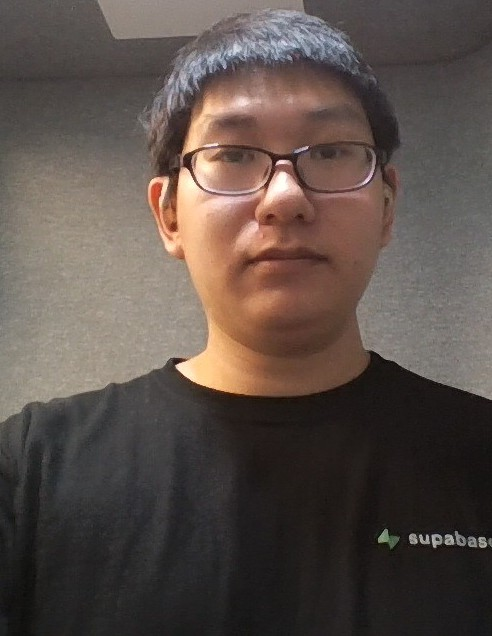
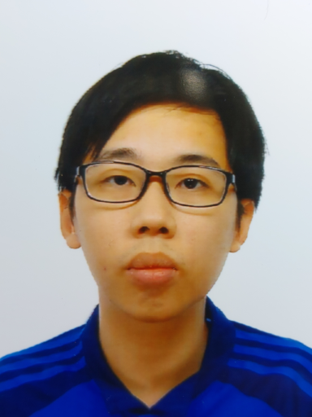

We are a team based in the [School of Computing, National University of Singapore](https://www.comp.nus.edu.sg).

You can reach us at the email `seer[at]comp.nus.edu.sg`

## Project team

### John Doe

[[homepage](http://www.comp.nus.edu.sg/~damithch)]
[[github](https://github.com/johndoe)]
[[portfolio](team/johndoe.md)]

* Role: Project Advisor

### Jane Doe

[[github](https://github.com/LonelyFort)]
[[portfolio](team/johndoe.md)]

* Role: Team Lead
* Responsibilities: UI

### San Muyun

[[github](http://github.com/jhttps://github.com/SAN-MUYUN)] [[portfolio](https://www.linkedin.com/in/muyun-san-870748186/)]

* Role: Developer
* Responsibilities: Backend

### Jean Doe

[[github](http://github.com/johndoe)]
[[portfolio](team/johndoe.md)]

* Role: Developer
* Responsibilities: Dev Ops + Threading

### Choo Jun Inn darren

[[github](http://github.com/darrenchooji)]
[[portfolio](https://www.linkedin.com/in/choojuninndarren/)]

* Role: Developer
* Responsibilities: UI

### Wallace Peck

[[github](http://github.com/wallacepck)]
[[portfolio](https://wallacepck.github.io)]

* Role: Developer
* Responsibilities: Git expert
