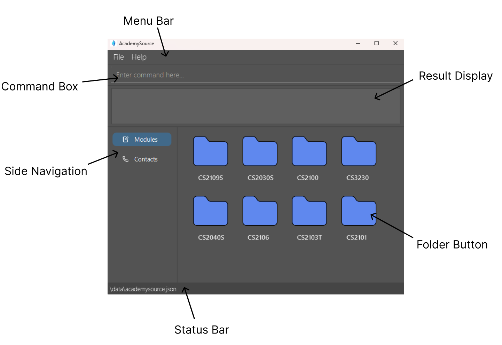
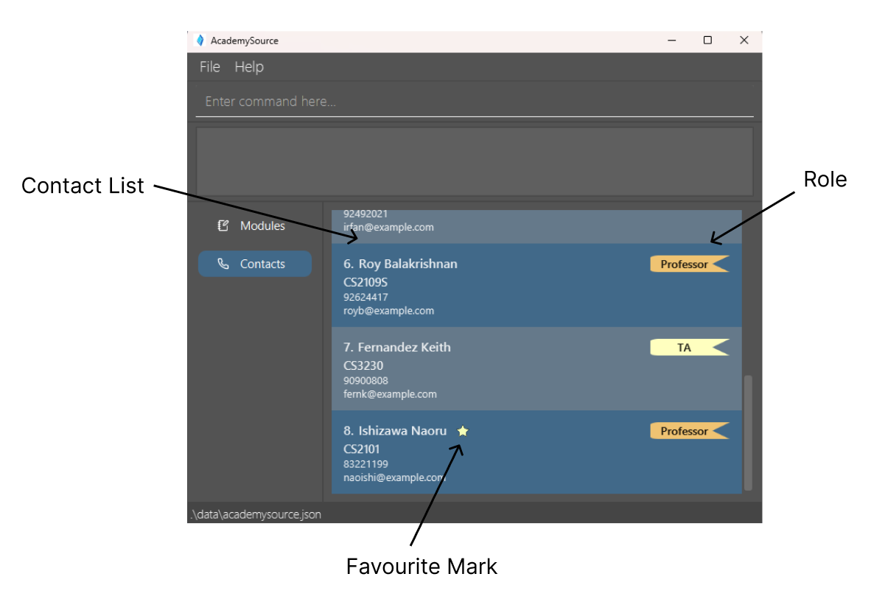
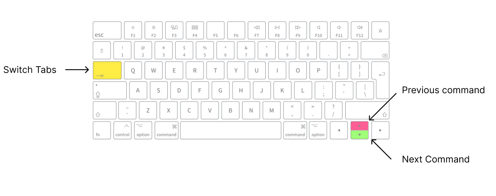

<div style="display: flex; justify-content: center; align-items: center;">
<span class="parisienne-regular" style="font-size: 3em; font-weight: bold;">
  AcademySource User Guide
</span>
</div>

**AcademySource** is a streamlined contact management **desktop app built for use via command-line interface (CLI)**, designed to help students stay connected with their academic network. It centralizes key contact details of professors and teaching assistants,
removing the need to dig through emails or portals. With its simple and efficient CLI-based design, AcademySource lets you manage academic contacts quickly and effortlessly—so you can stay organized and focused on your learning journey.

With AcademySource, you can:
* Store and manage contact information of professors and TAs (e.g., email, phone number, role, module)
* Search for contacts by name, contact details, role, and/or module code
* Mark important contacts as favorites for quick access
  
--------------------------------------------------------------------------------------------------------------------

## Table of Contents
- [Quick start](#quick-start)
- [Graphic User Interface Layout](#graphic-user-interface-layout)
- <details>
    <summary>
        <a href="#features">Features</a>
    </summary>
    <a href="#prefix-table"> - Prefix table <br></a>
    <a href="#accepted-modules"> - Modules Accepted by AcademySource <br></a>
    <a href="#viewing-help--help"> - Viewing help <br></a>
    <a href="#listing-all-persons--list"> - Listing all persons <br></a>
    <a href="#adding-a-person--add"> - Adding a person <br></a>
    <a href="#editing-a-person--edit"> - Editing a person <br></a>
    <a href="#locating-persons-by-name-phone-module-and-favourites--find"> - Locating persons by name, phone, module and favourite <br></a>
    <a href="#mark-un-mark-a-person-as-favourite--fav"> - Mark / un-mark a person as favourite <br></a>
    <a href="#deleting-a-person--delete"> - Deleting a person <br></a>
    <a href="#clearing-all-entries--clear"> - Clearing all entries <br></a>
    <a href="#exiting-academysource--exit"> - Exiting AcademySource <br></a>
    <a href="#saving-the-data"> - Saving the data <br></a>
    <a href="#editing-the-data-file"> - Editing the data file <br></a>
  
  </details>
- [FAQ](#faq)
- [Known issues](#known-issues)
- [Command summary](#command-summary)
- [Glossary](#glossary)

## Quick start

1. Ensure you have `Java 17` or above installed on your computer. Follow the steps below to check if you already have `Java 17` installed:
   2. Navigate to your operating system's terminal:
      <details>
          <summary><strong>For Windows:</strong></summary>
              <ol>
                  <li>Hold down Windows button and R (⊞ Win + R)</li>
                  <li>Type <code>cmd</code> and press enter</li>
              </ol>
      </details>
      <details>
          <summary><strong>For MacOS:</strong></summary>
              <ol>
                  <li>Click the Launchpad icon in the Dock, type <code>Terminal</code> in the search field, then click Terminal, OR</li>
                  <li>In the Finder, open the <code>/Applications/Utilities</code> folder, then double-click Terminal.</li>
              </ol>
      </details>
      
   3. Type <code>java -version</code> and press enter. 
   4. If you have `Java 17` installed, the terminal should look like:
       <details>
           <summary><strong>On Windows:</strong></summary>
               <pre><code>
       C:\Users\UserName>java -version
       java version "17.0.12" 2024-07-16 LTS
       Java(TM) SE Runtime Environment (build 17.0.12+8-LTS-286)
       Java HotSpot(TM) 64-Bit Server VM (build 17.0.12+8-LTS-286, mixed mode, sharing)
               </code></pre>
       </details>
       <details>
           <summary><strong>On MacOS:</strong></summary>
               <pre><code>
      user@username-MacBook-Air-3 ~ % java -version
      openjdk version "17.0.11" 2024-04-16 LTS
      OpenJDK Runtime Environment Zulu17.50+19-CA (build 17.0.11+9-LTS)
      OpenJDK 64-Bit Server VM Zulu17.50+19-CA (build 17.0.11+9-LTS, mixed mode, sharing)
               </code></pre>
       </details>
   

2. If you have `Java 17` installed, proceed to Step 3. If not, follow these instructions:
   3. Download `Java 17` from [here](https://www.oracle.com/java/technologies/javase/jdk17-archive-downloads.html). 
   4. Select the installation package based on your Operating System. 
   5. Follow the instruction guide to install Java on your device. For more information, click [here](https://docs.oracle.com/en/java/javase/23/install/overview-jdk-installation.html).
   6. **Mac users:** Ensure you have the precise JDK version prescribed [here](https://se-education.org/guides/tutorials/javaInstallationMac.html).  


3. Download the latest version of AcademySource from [here](https://github.com/AY2425S2-CS2103T-T17-4/tp/releases/tag/v1.3). Select `academysource.jar` to begin the download.


4. Copy the file to the folder you want to use as the _home folder_ for AcademySource. Note: This will create additional files required for AcademySource in your _home folder_.


5. Open AcademySource by double-clicking the program file, `academysource.jar`. Alternatively, you may type `java -jar academysource.jar` into your [terminal](#quick-start) and press enter.  
   **What you'll see:**   
   <details>
        <summary><strong>On Windows:</strong></summary>
            
   </details>
   <details>
        <summary><strong>On Mac OS:</strong></summary>
            
   </details>


6. Type a command in the command box and press Enter to execute it. For example, typing **`help`** and pressing Enter will open the help window.<br>
   Some example commands you can try:

    * `list` : Lists all contacts.

    * `add n/John Doe p/98765432 e/johnd@example.com r/TA m/CS2103T` : Adds a contact named John Doe to AcademySource with the phone number 98765432, email address johnd@example.com, role of TA and module CS2103T.

    * `delete 3` : Deletes the 3rd contact shown in the current list.

    * `clear` : Deletes all contacts.

    * `exit` : Exits the app.


7. Refer to the [Features](#features) below for details of each command.

<div markdown="block" class="alert alert-info">

**:information_source: Notes about the command box:**<br>

The command box remembers up to 16 previous commands. You can use the Up Arrow (↑) on your keyboard to scroll back through them and the Down Arrow (↓) to move forward. This saves time by letting you reuse commands without retyping them.

If you edit a recalled command, the navigation resets, and you can’t scroll forward anymore. Once you press Enter, the modified command is saved as a new history entry.

Example:
1. You type: `find mm/2040` and press Enter

2. You type: `list` and press Enter

3. You press Up Arrow (↑) once → It shows `list`.

4. You press Up Arrow (↑) again → It shows `find mm/2040`.

5. Now, if you change `find mm/2040` to `find mm/2103` and then press Down Arrow (↓), you will notice that you aren't moving forward through history because you modified the command.
   However, you can still press Up Arrow (↑) to access `list` and `find mm/2040` again.

</div>

[Back to top](#table-of-contents)

--------------------------------------------------------------------------------------------------------------------

## Graphic User Interface Layout





Basic features:
1. Menu Bar: A top menu bar which provides access to various functions within AcademySource.
2. Command Box: An input with a placeholder "Enter Command Here..." to enter commands into.
3. Result Display: A rectangular display box to display success message upon successful command execution, or error message upon failure.
4. Side Navigation: Buttons to navigate between Modules and Contacts tab. Press the buttons or TAB key to navigate 
between both.

Modules Page:
1. Module Files: A folder that stores all contacts related to the module code.
   Upon pressing, AcademySource will be directed to contacts page which displays contacts that matches the module code.

<div markdown="span" class="alert alert-warning">:exclamation: **Caution:**

Commands can still be entered and work on the modules page, but the contact list is not visible. Thus, avoid entering commands that modify data (such as `edit`, `delete`) on the module page to prevent inadvertent actions.

</div>

Contacts Page:
1. Contact List: A list of contacts stored inside AcademySource. Each row stores a contact name card with their relevant details.
2. Role: The role which each contact is assigned to. TA will be displayed as yellow bookmarker while Professor will be displayed as orange bookmarker.
3. Favourite Mark: A star symbol which indicate a contact is marked as favourite by you.

[Back to top](#table-of-contents)

--------------------------------------------------------------------------------------------------------------------

## Keybinds



* TAB: Toggles between window between Modules and Contacts Tab.
* UP ARROW (↑): Goes back to previous command in history.
* DOWN ARROW (↓): Goes forward to next command in history.

<div markdown="block" class="alert alert-info">

**:information_source: Notes regarding TAB key function:**<br>

The TAB key will not switch windows between Modules and Contacts Tab if one of the Menu dropdowns is opened (File, Help)
or if Help window is opened. This is an intended behaviour, not a bug.

</div>

[Back to top](#table-of-contents)

--------------------------------------------------------------------------------------------------------------------

## Features [🔝](#table-of-contents)

<div markdown="span" class="alert alert-warning">:exclamation: **Caution:**

AcademySource works best with standard English letters. Using characters from other languages (like Arabic, Chinese, or Hebrew) or emojis might cause display and input issues. To keep things running smoothly, please stick to English letters for now.

</div>

<div markdown="block" class="alert alert-info">

**:information_source: Notes about the command format:**<br>

* Command words are case-sensitive.<br>
  e.g. `list` works, but not `List` or `LIST`.

* Prefixes are also case-sensitive.<br> 
  e.g. `N/` (instead of `n/`) will not be allowed.

* Words in `UPPER_CASE` are the parameters to be supplied by the user.<br>
  e.g. in `add n/NAME`, `NAME` is a parameter which can be used as `add n/John Doe`.

* Items in square brackets are optional.<br>
  e.g `n/NAME [m/MODULE]` can be used as `n/John Doe m/CS2103T` or as `n/John Doe`.

* Items with `…`​ after them can be used multiple times including zero times.<br>
  e.g. `[m/MODULE]…​` can be used as ` ` (i.e. 0 times), `m/CS2103T`, `m/CS2103T m/CS2040S` etc.

* Parameters can be in any order.<br>
  e.g. if the command specifies `n/NAME p/PHONE_NUMBER`, `p/PHONE_NUMBER n/NAME` is also acceptable.

* Extraneous parameters for commands that do not take in parameters (such as `help`, `list`, `exit` and `clear`) will be ignored.<br>
  e.g. if the command specifies `help 123`, it will be interpreted as `help`.

* If you are using a PDF version of this document, be careful when copying and pasting commands that span multiple lines as space characters surrounding line-breaks may be omitted when copied over to the application.

</div>

<a id="prefix-table"></a>
### Prefix Table [🔝](#table-of-contents)

| **Prefix** | **Meaning**                | **Usage Example**                    | **Keyword(s) Rules**                                                                                                                                                                                                                                                                                                                                                                                                       |
|------------|----------------------------|--------------------------------------|----------------------------------------------------------------------------------------------------------------------------------------------------------------------------------------------------------------------------------------------------------------------------------------------------------------------------------------------------------------------------------------------------------------------------|
| `n/`       | Name                       | `n/John Doe`                         | `add`, `edit`, and `find`: Name must only contain alphanumeric characters and spaces. <br> **NOTE: When using `add` or `edit`, duplicate names will not be allowed.**                                                                                                                                                                                                                                                      |
| `p/`       | Phone number               | `p/98765432`<br> `p/+91234567`       | `add` & `edit`: Phone can optionally start with a `+`, followed by 3-17 digits. <br> `find`: Phone can optionally start with a `+`, followed by 1-17 digits.                                                                                                                                                                                                                                                               |
| `t/`       | Telegram                   | `t/@johndoe`                         | `add` & `edit`: Telegram must begin with `@` and have 5–32 characters (excluding starting `@`). The first character after '@' must be an alphabet; only alphanumerics and underscores are allowed in the remaining handle, and the handle after '@' cannot start or end with special characters. <br> `find`: Must only contain alphanumerics, underscores, or @.                                                          |
| `r/`       | Role (`ta` or `prof`)      | `r/TA` or `r/PROF`                   | `add` & `find`: Role must either be one of two roles, `TA` or `PROF`, case-insensitive. <br> **NOTE: Not used in `edit`.**                                                                                                                                                                                                                                                                                                 |
| `e/`       | Email address              | `e/johnd@example.com`                | `add` & `edit`: Email must follow local-part@domain. The local-part may only contain alphanumerics and the allowed special characters (`+_.-`) without starting or ending with them. The domain consists of domain labels separated by periods, each starting and ending with alphanumerics (separated only by hyphens, if any), and the end domain label must be at least 2 characters long. <br> `find`: No restriction. |
| `m/`       | Module (can have multiple) | `m/CS2101` <br> `m/CS2103T m/CS2101` | `add` & `edit`. Module must be a valid module code, case-insensitive. <br> **NOTE: Not used in `find`.** <br> See [Accepted Modules](#accepted-modules) for a list of valid module codes.                                                                                                                                                                                                                                  |
| `f/`       | Favourite                  | `f/y` or `f/n`                       | `find`: Favourite must be either one `y` or `n`. <br> **NOTE: Not used in `add` and `edit`.**                                                                                                                                                                                                                                                                                                                              |
| `mm/`      | Module(s)                  | `mm/CS2103T` or `mm/CS2101 CS2103T`  | `find`: Module(s) must only contain alphanumerics. <br> **NOTE: Not used in `add` and `edit`.**
**Note:** Each prefix must be followed by at least one non-empty keyword. Empty keywords are not allowed for any of the prefixes.

[Click here for find function prefix matching details](#prefix-matching-details)

<a id="accepted-modules"></a>
### Modules Accepted by AcademySource [🔝](#table-of-contents)

| **Module Code** | **Module Name**                                       |
|-----------------|-------------------------------------------------------|
| CS1231S         | Discrete Structures                                   |
| CS2030S         | Programming Methodology II                            |
| CS2040S         | Data Structures and Algorithms                        |
| CS2100          | Computer Organisation                                 |
| CS2103T         | Software Engineering                                  |
| CS2106          | Introduction to Operating Systems                     |
| CS2109S         | Introduction to AI and Machine Learning               |
| CS3230          | Design and Analysis of Algorithms                     |
| CS2101          | Effective Communication for Computing Professionals   |

<a id="viewing-help--help"></a>
### Viewing help : `help` [🔝](#table-of-contents)

Shows a message explaining how to access the help page.


Format: `help`

<a id="listing-all-persons--list"></a>
### Listing all persons : `list` [🔝](#table-of-contents)

Shows a list of all contacts in AcademySource.

Before command:


After command:


Format: `list`

<a id="adding-a-person--add"></a>
### Adding a person: `add` [🔝](#table-of-contents)

Adds a contact to AcademySource.

Before command:


After command:


Format: `add n/NAME p/PHONE_NUMBER e/EMAIL r/ROLE [t/TELEGRAM] [m/MODULE] [m/MORE_MODULES]…​`

<div markdown="span" class="alert alert-primary">:bulb: **Tip:**
A person can have any number of modules (including 0)
</div>

* `ROLE` must be either `ta` or `prof` (Case-insensitive, which means `TA` or `Prof` are also valid).
* `MODULE`must be one of the accepted module codes given in [the module table.](#modules-accepted-by-academysource-)

Examples:
* `add n/John Doe p/98765432 e/johnd@example.com r/prof m/CS2103T`
* `add n/Betsy Crowe e/betsycrowe@example.com p/1234567 r/TA m/CS2103T t/@johnd`

<a id="editing-a-person--edit"></a>
### Editing a person : `edit` [🔝](#table-of-contents)

Edits an existing contact in AcademySource.

Before command:


After command:


Format: `edit INDEX [n/NAME] [p/PHONE] [e/EMAIL] [t/TELEGRAM] [m/MODULE] [m/MORE_MODULES]…​`

* Edits the person at the specified `INDEX`. The index refers to the index number shown in the displayed person list. The index **must be a positive integer** 1, 2, 3, …​
* At least one of the optional fields must be provided.
* Existing values will be updated to the input values.
* Roles can not be edited.
* When editing modules, the existing modules of the person will be removed i.e adding of modules is not cumulative.
* `MODULE`must be one of the accepted module codes given in [the module table.](#modules-accepted-by-academysource-)

Examples:
*  `edit 1 p/91234567 e/johndoe@example.com` Edits the phone number and email address of the 1st person to be `91234567` and `johndoe@example.com` respectively.
*  `edit 2 n/Betsy Crower m/` Edits the name of the 2nd person to be `Betsy Crower` and clears all existing modules.
*  `edit 2 m/CS2103T m/CS2106` Edits the module of the 2nd person to be `CS2103T` and `CS2106`.
*  `edit 2 t/` clears existing telegram for 2nd person.

<a id="locating-persons-by-name-phone-module-and-favourites--find"></a>
### Locating persons by name, phone, module, and favourites: `find` [🔝](#table-of-contents)

Finds persons whose names contain any of the given keywords.

Before command:


After command:


Format: `find [n/NAME_KEYWORDS] [p/PHONE_KEYWORDS] [mm/MODULE_KEYWORDS] [f/FAVOURITE_STATUS] [r/ROLE] [t/TELEGRAM_KEYWORDS] [e/EMAIL_KEYWORDS]`

<a id="prefix-matching-details"></a>
**Prefix Matching Details:**

- **`n/`** — Supports **case-insensitive** and **partial** name matches.
- **`p/`** — Supports **partial** phone number matches.
- **`mm/`** — Supports **case-insensitive** and **partial** module code matches.
- **`f/`** — Supports **case-insensitive** favourite status matches.
- **`r/`** — Supports **case-insensitive** role matches.
- **`t/`** — Supports **case-insensitive** and **partial** Telegram handle matches.
- **`e/`** — Supports **case-insensitive** and **partial** email matches.

---

#### 🔎 Search Behavior

- **Case-Insensitive & Partial Matching:**  
  The search for names, phone numbers, and module codes is performed in a case-insensitive manner and supports partial keyword matching.  
  _Example:_ `find n/john` matches a person named "John Doe".

- **Keyword Order:**  
  For names, the order of keywords does not matter. For example, `find n/Hans Bo` matches "Bo Hans".

- **Single Instance per Prefix:**  
  Only **one instance** of each prefix is allowed. Repeating a prefix (e.g. `n/John n/Doe`) is not permitted.

- **AND Combination:**  
  When multiple prefixes are specified (e.g. `find n/John mm/CS2103T`), a person must satisfy **all criteria** (i.e. the keywords across the different fields are combined using an AND operation) to be included in the results.

---

#### ✅ Valid Examples

| Command                        | Description                                                                                             |
|--------------------------------|---------------------------------------------------------------------------------------------------------|
| `find n/John`                  | Finds persons with names matching `John` (e.g., "John Doe").                                            |
| `find n/alex david`            | Finds persons with names matching either `alex` or `david` (e.g., "Alex Yeoh", "David Li").             |
| `find p/9123`                  | Finds persons whose phone numbers contain `9123` (e.g., "91234567").                                    |
| `find mm/2103 CS3230`          | Finds persons with module codes that contain "2103" **or** "CS3230" (e.g. `CS2103T`, `CS2103`, `CS3230` |
| `find f/y`                     | Finds persons marked as favourites.                                                                     |
| `find r/prof`                  | Finds persons with the role of Professor.                                                               |
| `find t/@john_doe`             | Finds persons whose Telegram handle matches `@john_doe`.                                                |
| `find e/john@gmail.com`        | Finds persons whose email matches `john@gmail.com`                                                       |
| `find n/John Demar mm/CS2103T` | Finds persons whose name contains "John" **or** "Demar" **and** are in the module "CS2103T".            |
| `find mm/CS2103 f/y`           | Finds persons whose module matches `CS2103` **and** who are marked as favourites.                       |

---

#### ❌ Invalid Examples

| Command                    | Reason                                                                                                                            |
|----------------------------|-----------------------------------------------------------------------------------------------------------------------------------|
| `find`                     | No search prefixes provided.                                                                                                      |
| `find n/John n/Doe`        | Duplicate `n/` prefix is not allowed.                                                                                             |
| `find f/maybe`             | Invalid value for `f/`. Only `y` or `n` are allowed.                                                                              |
| `find r/student`           | Invalid value for `r/`. Only `prof` or `ta` are allowed.                                                                          |
| `find n/John$`             | Invalid name. Special characters like `$` are not permitted. *(Names only allow alphabets and spaces)*                            |
| `find t/john#doe`          | Invalid Telegram handle. Characters like `#` are not allowed. *(Telegram handles only allow alphabets, digits, underscore, or @)* |

---

<a id="mark-un-mark-a-person-as-favourite--fav"></a>
### Mark / un-mark a person as favourite : `fav` [🔝](#table-of-contents)

Mark a specific person as favourite, or un-mark a person from favourite if that person is
already marked as favourite.
A star will be shown beside the person's name if it is marked as favourite.

Before command:


After command:


Format: `fav INDEX`

* Toggles the favourite status of the person at the specified `INDEX`.
* The index refers to the index number shown in the displayed person list.
* the index **must be a positive integer** 1, 2, 3, …​

Examples:
* `list` followed by `fav 2` marks the 2nd contact in AcademySource as favourite.
* `fav 2` again un-marks the person.

<a id="deleting-a-person--delete"></a>
### Deleting a person : `delete` [🔝](#table-of-contents)

Deletes the specified contact from AcademySource.

Before command:


After command:


Format: `delete INDEX [MORE INDEX]`

* Deletes the person at the specified `INDEX`.
* The index refers to the index number shown in the displayed person list.
* The index **must be a positive integer** 1, 2, 3, …​
* Index should not repeat in the same command.

Examples:
* `list` followed by `delete 2` deletes the 2nd contact from the result of the `list` command.
* `find Betsy` followed by `delete 1` deletes the 1st contact in the results of the `find` command.
* `delete 1 2 3` deletes the first 3 contacts, given that all indexes exist within the contact list.

<a id="clearing-all-entries--clear"></a>
### Clearing all entries : `clear` [🔝](#table-of-contents)

Clears all entries from AcademySource.

Before command:


After command:


Format: `clear`

<a id="exiting-academysource--exit"></a>
### Exiting AcademySource : `exit` [🔝](#table-of-contents)

Exits AcademySource.

Format: `exit`

<a id="saving-the-data"></a>
### Saving the data [🔝](#table-of-contents)

AcademySource data are saved in the hard disk automatically after any command that changes the data. There is no need to save manually.

<a id="editing-the-data-file"></a>
### Editing the data file [🔝](#table-of-contents)

AcademySource data are saved automatically as a JSON file `[JAR file location]/data/academysource.json`. Advanced users are welcome to update data directly by editing that data file.

<div markdown="span" class="alert alert-warning">:exclamation: **Caution:**
If your changes to the data file makes its format invalid, AcademySource will discard all data and start with an empty data file at the next run. Hence, it is recommended to take a backup of the file before editing it.<br>
Furthermore, certain edits can cause AcademySource to behave in unexpected ways (e.g., if a value entered is outside of the acceptable range). Therefore, edit the data file only if you are confident that you can update it correctly.
</div>

--------------------------------------------------------------------------------------------------------------------

## FAQ

**Q**: How do I transfer my data to another Computer?<br>
**A**: Install the app in the other computer and overwrite the empty data file it creates with the file that contains the data of your previous AcademySource home folder.

[back to top](#table-of-contents)

--------------------------------------------------------------------------------------------------------------------

## Known issues

1. **When using multiple screens,** if you move the application to a secondary screen, and later switch to using only the primary screen, the GUI will open off-screen. The remedy is to delete the `preferences.json` file created by the application before running the application again.
2. **If you minimize the Help Window** and then run the `help` command (or use the `Help` menu, or the keyboard shortcut `F1`) again, the original Help Window will remain minimized, and no new Help Window will appear. The remedy is to manually restore the minimized Help Window.
3. **All commands are functional in Module Page,** despite not able to see the details of contacts. Use ```list``` or ```find``` command to display the desired contacts before editing the contact list.
4. **Using complex characters** like emojis or script (Arabic and Hebrew) causes the command box input to behave in weird ways. Avoid entering these characters in the command box.
5. **On the modules page** commands can still be entered and work, but the contact list is not visible. Thus, avoid entering commands on the module page to prevent inadvertent actions. 

[back to top](#table-of-contents)

--------------------------------------------------------------------------------------------------------------------

## Command summary

| Action        | Format, Examples                                                                                                                                                                                                                   |
|---------------|------------------------------------------------------------------------------------------------------------------------------------------------------------------------------------------------------------------------------------|
| **Add**       | `add n/NAME p/PHONE_NUMBER e/EMAIL r/ROLE [m/MODULE]…​` <br> e.g., `add n/James Ho p/22224444 e/jamesho@example.com r/TA m/CS2103T`                                                                                                |
| **Clear**     | `clear`                                                                                                                                                                                                                            |
| **Delete**    | `delete INDEX…​` <br> e.g., `delete 1` `delete 2 3`                                                                                                                                                                                |
| **Edit**      | `edit INDEX [n/NAME] [p/PHONE_NUMBER] [e/EMAIL] [m/MODULE]…​`<br> e.g.,`edit 2 n/James Lee e/jameslee@example.com`                                                                                                                 |
| **Find**      | `find [n/NAME_KEYWORDS] [p/PHONE_KEYWORDS] [mm/MODULE_KEYWORDS] [f/FAVOURITE_STATUS] [r/ROLE] [t/TELEGRAM_KEYWORDS] [e/EMAIL_KEYWORDS]` <br> e.g., `find n/James p/98765432 m/CS2106 f/y t/@JamesLovesCS r/PROF e/james@gmail.com` |
| **Favourite** | `fav INDEX` <br> e.g., `fav 1`                                                                                                                                                                                                      |
| **List**      | `list`                                                                                                                                                                                                                             |
| **Help**      | `help`                                                                                                                                                                                                                             |
| **Exit**      | `exit`                                                                                                                                                                                                                             |

[back to top](#table-of-contents)

--------------------------------------------------------------------------------------------------------------------
## Glossary

| Term           | Definition                                                                                                                                                                     |
|----------------|--------------------------------------------------------------------------------------------------------------------------------------------------------------------------------|
| **CLI**        | `Command Line Interface; a way to interact with the application using` <br> `text-based commands`                                                                              |
| **Index**      | `A positive integer that refers to a contact's position in the displayed list`                                                                                                 |
| **JDK**        | `Java Development Kit; a software development environment required to run and develop Java` <br> `applications like AcademySource. Version 17 or above is needed`              |
| **Parameters** | `Values supplied by the user in commands (e.g., name, phone, module) that determine the` <br> `action taken by AcademySource. Often prefixed with identifiers like n/, p/, m/` |
| **Field**      | `A specific piece of information in a contact entry, such as name, phone number, email, role, or module`                                                                       |

[back to top](#table-of-contents)
